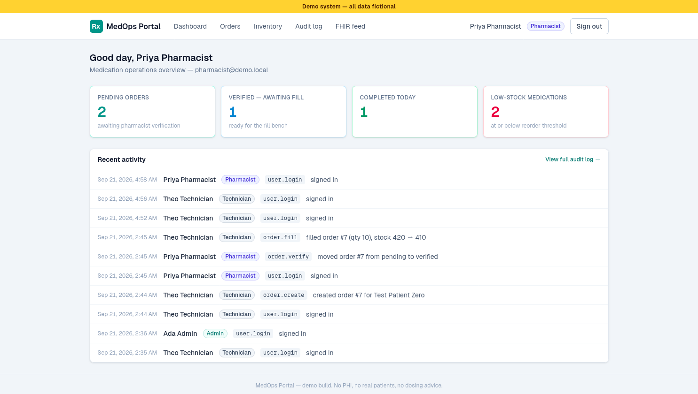
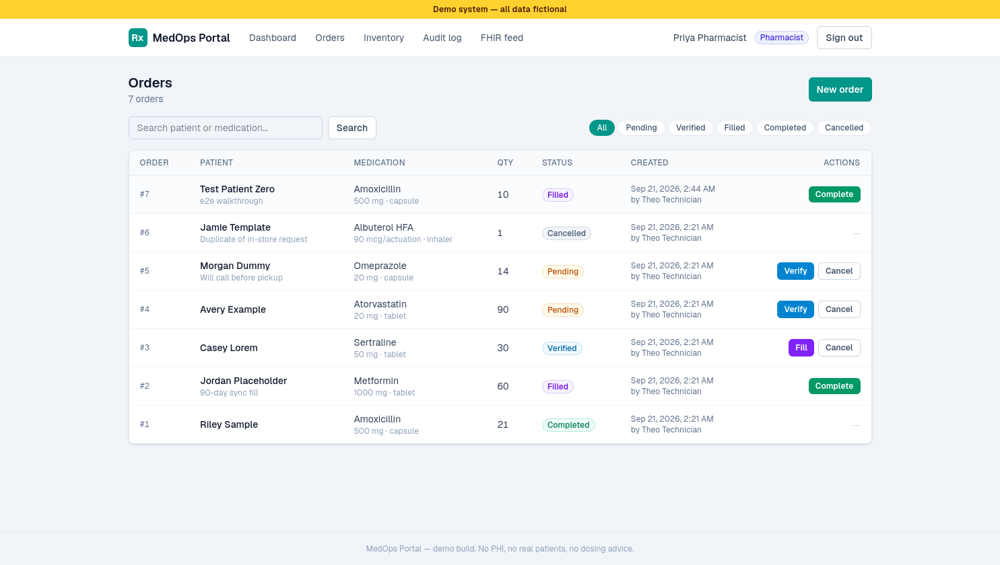
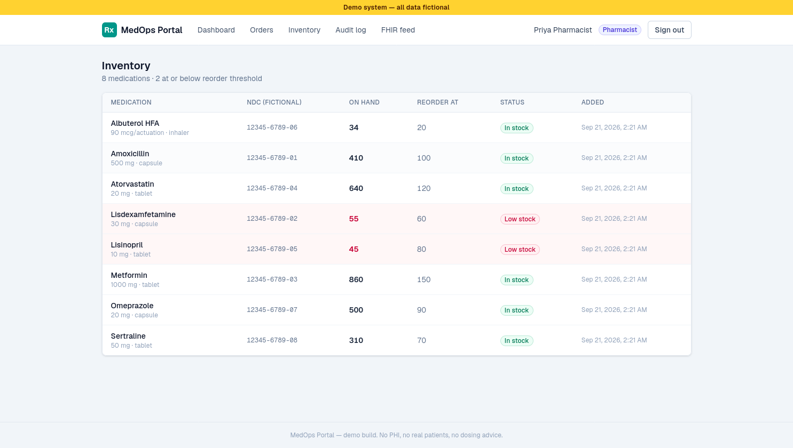
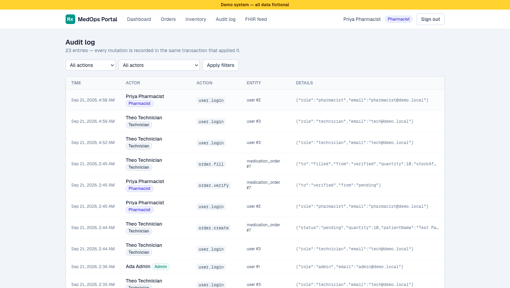
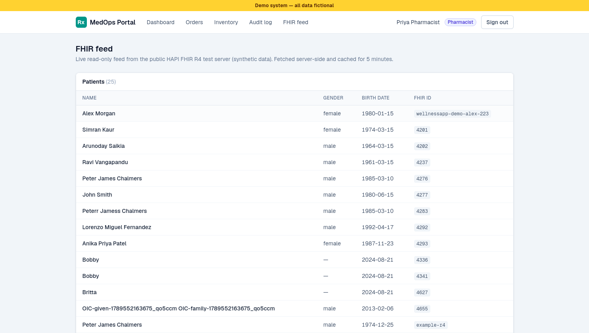

# MedOps Portal

**Medication Operations Portal** — a full-stack demo of an internal workflow system for a pharmacy/clinic team: medication order lifecycle, inventory control, and a complete audit trail.

> **Demo system — all data fictional.** Every user, patient, medication, and NDC in this repository is invented test data. There is no PHI, no real patients, and no drug-safety information anywhere in this codebase.

Stack: **Next.js (App Router) · React 19 · TypeScript (strict) · Tailwind v4 · PostgreSQL 16 · Drizzle ORM · Auth.js v5 (credentials + JWT) · Vitest**

---

## Why this exists (the business problem)

In a pharmacy, an order is not just a row in a table — it is a regulated handoff between people. A technician enters an order, a pharmacist verifies it, someone fills it against physical stock, and someone closes it out. When that handoff lives in spreadsheets or a shared inbox, two failure modes dominate: **steps get skipped** (filled before anyone verified the order) and **nobody can say afterwards who did what** (which is exactly what regulators and incident reviews ask for first).

MedOps Portal encodes those two requirements directly in the service layer:

1. **Status discipline** — an order can only move `pending → verified → filled → completed`, with cancellation allowed only while it is still `pending` or `verified`. Illegal transitions are rejected server-side with typed errors; the UI never decides what is allowed.
2. **Audit trails** — every mutation (order create/verify/fill/complete/cancel, inventory adjustments, logins) writes an `audit_logs` row **in the same database transaction** as the change itself. If the change didn't happen, the audit row doesn't exist — and vice versa.

The third domain rule is inventory: **filling an order decrements stock in the same transaction as the fill**, guarded by a row-level check, so insufficient stock is a clean typed error (`INSUFFICIENT_STOCK`) rather than a partial write.

## Architecture

```
                       ┌──────────────────────────────────────────────┐
                       │                 Next.js app                  │
                       │                                              │
  Browser ────────────►│  Pages (RSC)            Client components    │
                       │  ┌──────────────┐        ┌────────────────┐  │
                       │  │ / (dashboard)│        │ row actions,   │  │
                       │  │ /orders      │        │ login & stock  │  │
                       │  │ /audit       │        │ forms (fetch)  │  │
                       │  │ /medications │        └───────┬────────┘  │
                       │  │ /fhir        │                │ HTTP      │
                       │  └──────┬───────┘                │           │
                       │         │ read via Drizzle       │           │
                       │         │                        ▼           │
                       │  proxy.ts (auth gate)  REST route handlers │
                       │  redirects → /login  ┌─────────────────────┤
                       │                      │ /api/auth/login|logout
                       │                      │ /api/orders (POST)
                       │                      │ /api/orders/[id]/{verify,fill,complete,cancel}
                       │                      │ /api/medications/[id]/adjust-stock
                       │                      └──────┬──────────────┘
                       │                             │
                       │                   src/lib/orderService.ts
                       │     (state machine · role checks · transactions · audit)
                       │                             │
                       │                      Drizzle ORM (pg)
                       └─────────────────────────────┼───────────────┘
                                                     ▼
                                         ┌───────────────────┐
                                         │  PostgreSQL 16    │
                                         │  db      :5433    │
                                         │  db-test :5434    │
                                         └───────────────────┘
```

**Auth flow (Auth.js v5, JWT sessions):**

```
POST /api/auth/login {email, password}
  → bcrypt verify against users.password_hash (src/lib/authService.ts)
  → session JWT minted with next-auth/jwt `encode`
      payload: { sub, name, email, role }, salt = session cookie name
  → httpOnly cookie `authjs.session-token` set on the response
  → later requests: route handlers read the cookie with `getToken`
    (getSessionUserFromRequest) and pages use `auth()` from src/auth.ts
  → proxy.ts (Next 16 middleware) redirects unauthenticated page
    requests to /login; API routes enforce their own 401/403
```

A credentials provider with the same `verifyCredentials` logic is registered in `src/auth.ts`, so the standard Auth.js endpoints work too. Sessions are stateless JWTs signed with `AUTH_SECRET` — no session table.

### Role / permission matrix

Roles are cumulative: a pharmacist can do everything a technician can, an admin everything a pharmacist can. All checks are enforced **server-side** in `orderService.ts` (`roleCan`), never only in the UI.

| Action                                  | Technician | Pharmacist | Admin |
| --------------------------------------- | :--------: | :--------: | :---: |
| Create order                            |     ✅     |     ✅     |  ✅   |
| Fill verified order (decrements stock)  |     ✅     |     ✅     |  ✅   |
| Verify pending order                    |     ❌     |     ✅     |  ✅   |
| Cancel pending/verified order           |     ❌     |     ✅     |  ✅   |
| Complete filled order                   |     ❌     |     ✅     |  ✅   |
| Adjust inventory stock                  |     ❌     |     ❌     |  ✅   |
| View audit log                          |     ❌     |     ✅     |  ✅   |
| View dashboard / orders / inventory     |     ✅     |     ✅     |  ✅   |

### Order status state machine

```
                 verify (pharmacist+)
   ┌─────────┐ ─────────────────────► ┌──────────┐
   │ pending │                        │ verified │
   └─────────┘ ◄──┐                   └────┬─────┘
                  │                        │ fill (technician+, stock ↓)
   cancel         │ cancel                 ▼
   (pharmacist+)  │                   ┌─────────┐ complete (pharmacist+)
                  │                   │  filled │ ─────────────────────┐
                  ▼                   └─────────┘                      ▼
             ┌───────────┐                                          ┌───────────┐
             │ cancelled │                                          │ completed │
             └───────────┘                                          └───────────┘
              (terminal)                                             (terminal)
```

Any transition not drawn above is rejected with an `INVALID_TRANSITION` typed error — including "verify twice", "fill before verify", and "cancel after fill".

## Quickstart

Prerequisites: Docker, Node.js 20+, npm.

```bash
npm install

# 1. Start both Postgres services (dev on :5433, test on :5434)
docker compose up -d          # or: npm run db:up

# 2. Migrate + seed the dev database
npm run db:migrate
npm run db:seed

# 3. Run the app
npm run dev                   # http://localhost:3000
```

Sign in with any of the seeded demo accounts (password for all: `demo1234!`):

| Account                 | Role       |
| ----------------------- | ---------- |
| `admin@demo.local`      | Admin      |
| `pharmacist@demo.local` | Pharmacist |
| `tech@demo.local`       | Technician |

The seed is idempotent — run it as many times as you like. Re-running migrations is safe as well (Drizzle tracks applied migrations in the database).

### npm scripts

| Script                    | What it does                                                     |
| ------------------------- | ---------------------------------------------------------------- |
| `db:up`                   | `docker compose up -d` (both Postgres containers)                 |
| `db:migrate`              | Apply Drizzle migrations to `DATABASE_URL` (`.env` → dev DB)      |
| `db:migrate:test`         | Apply migrations to the **test** DB (`.env.test`)                 |
| `db:seed`                 | Idempotent demo seed (users, meds, orders, audit history)         |
| `dev` / `build` / `start` | Next.js dev server / production build / production server         |
| `lint` / `typecheck`      | ESLint / `tsc --noEmit`                                          |
| `test`                    | Migrates the test DB, then runs Vitest (unit + API integration)   |

## Testing

```bash
npm test
```

Tests run against a **real, dockerized PostgreSQL** (`db-test` service, port 5434, database `medops_test`) — nothing is mocked at the data layer. The `test` script first applies migrations to the test DB, then runs Vitest; suites run sequentially because they share the database, and each test truncates all tables first.

- **`tests/orderService.test.ts`** — the state machine (legal + illegal transitions), the role permission matrix, transactional fill behavior (stock decremented atomically, insufficient stock rolls back *everything* including the status update, audit row written in-transaction), low-stock boundary (`stockQuantity <= reorderThreshold`), and input validation.
- **`tests/api.test.ts`** — integration over the actual Next.js route handlers: login as each role, the full `create → verify → fill → complete` lifecycle across roles with stock assertions, `401` without a session, `403` for illegal role actions (technician verify/cancel, pharmacist/admin inventory rules), `409` for invalid transitions and insufficient stock, `404` for unknown orders.
- **`tests/fhir.test.ts`** — pure, offline (no network, no DB): feeds inline fixture Bundles through the FHIR mapping functions and asserts field mapping, missing-field tolerance, and that malformed bundles yield empty arrays instead of exceptions.

## FHIR integration slice

The `/fhir` page demonstrates a healthcare-interop read path alongside the portal's own workflow features. **FHIR (Fast Healthcare Interoperability Resources)** is the HL7 standard for exchanging healthcare data electronically: every piece of clinical or administrative information — a patient, a prescription, an observation — is a **Resource**, a small JSON object with a standard structure identified by a `resourceType` and `id`. FHIR servers expose resources over plain REST, so a search like `GET /Patient?_count=25` returns a **Bundle**: an envelope containing the matching resources.

**Request flow (server-side only — no browser CORS, no API keys, read-only):**

```
Browser ──► /fhir page (login-protected RSC, revalidate = 300)
                │  src/lib/fhir.ts fetches on the Next.js server
                ▼
          https://hapi.fhir.org/baseR4
            Patient?_count=25
            MedicationRequest?_count=25&_sort=-_lastUpdated
```

The browser never talks to the FHIR server directly. The Next.js server fetches the two search Bundles, maps them through tolerant pure mappers (`mapPatient`, `mapMedicationRequest` in `src/lib/fhir.ts`), and renders the tables. Responses are cached server-side for **5 minutes** (`revalidate = 300` on the page, matching `next: { revalidate: 300 }` on the fetches), so repeated visits don't hammer the sandbox. Each fetch has an **8-second timeout** and failures come back as typed results — a down or slow sandbox renders a friendly retry card instead of an error page, and a malformed resource is skipped, never thrown.

**PHI, and why this demo is safe.** In a real deployment the fields rendered here — patient names, birth dates, gender, and the `subject` references that tie a MedicationRequest to a person — are **PHI (Protected Health Information)** under HIPAA/GDPR and would demand a BAA, field-level access controls, encryption, retention rules and a real audit trail. This demo never touches any of that: it reads **only** from the public HAPI R4 test sandbox (https://hapi.fhir.org/baseR4), which exists to serve synthetic test data, and it is **not connected to any real EHR/Epic environment**. The client is strictly read-only — no write path, no SMART-on-FHIR OAuth flow, no credentials — and the page keeps a visible "synthetic data" disclaimer on screen.

## Project layout

```
src/
  app/
    page.tsx                  dashboard (KPI cards + recent audit feed)
    login/                    sign-in page (+ client form, demo account hints)
    orders/                   order table: search, status pills, pagination,
                              role-aware row actions with inline errors
    orders/new/               create-order form with inline validation errors
    medications/              inventory table, low-stock highlight, admin
                              inline stock adjuster
    audit/                    filterable audit log (pharmacist/admin only)
    fhir/                     read-only FHIR sandbox feed (patients +
                              medication requests, 5-min server cache)
    api/                      REST route handlers (thin — see orderService)
  lib/
    orderService.ts           business rules: state machine, permissions,
                              transactions, audit rows, typed errors
    fhir.ts                   read-only FHIR R4 client: typed mappers +
                              sandbox fetches (timeout, typed results)
    permissions.ts            pure state machine + role matrix (client-safe)
    queries.ts                read models for pages (joins, filters, counts)
    session.ts                JWT mint/decode helpers (Auth.js v5 compatible)
    authService.ts            bcrypt credential verification + login audit
  db/
    schema.ts                 Drizzle schema (users, medications,
                              medication_orders, audit_logs)
drizzle/                      generated migrations
scripts/                      migrate.ts, seed.ts
tests/                        Vitest unit + integration suites
```

## Design decisions worth knowing

- **One mutation surface.** All writes go through REST route handlers → `orderService`. Pages render server-side and client components call the API; there is no second "server actions" code path to keep in sync.
- **Typed service errors.** `OrderServiceError` carries a machine-readable `code` (`FORBIDDEN`, `INVALID_TRANSITION`, `INSUFFICIENT_STOCK`, `NOT_FOUND`, `INVALID_INPUT`) mapped to HTTP statuses by the handlers — so the same error powers both the JSON API and inline UI messages.
- **Concurrency-safe fills.** Fill selects the order *and* the medication `FOR UPDATE` inside the transaction and decrements stock with a SQL expression, so two simultaneous fills cannot oversell stock.
- **Cumulative roles** (see matrix) — real pharmacies let pharmacists do tech work; the role brief is interpreted this way and documented here.
- **Next 16 proxy.** The auth gate lives in `src/proxy.ts` (Next 16's rename of `middleware.ts`); it protects pages only — API routes self-enforce so they stay testable without a Next runtime.
- **Audit details are queryable JSON.** `audit_logs.details` stores `{ from, to, quantity, stockBefore, stockAfter, … }` jsonb, which is what makes the audit page filters and the dashboard feed useful.

## Limitations (read this before taking this further)

- **Fictional data only.** All medications, NDCs (`00000-0000-00` format but invented), patients, and users are fake. **No PHI is stored or processed**, and nothing here should be used for real patients.
- **Not a pharmacy system of record.** No dosing guidance, drug interactions, barcode scanning, or dispensing verification. It is a workflow demo, not clinical software — and not for clinical decision-making.
- **Not HIPAA-compliant / not production-hardened.** No BAA, no encryption-at-rest configuration, no field-level access controls, no retention policy, no penetration testing. The audit log is a demo feature, not a compliance control.
- **Credentials auth is for the demo.** Passwords are bcrypt-hashed, but there is no password reset, MFA, lockout, or email verification. Swap in your org's SSO/OIDC provider before real use (Auth.js v5 makes this a provider change, not a rewrite).
- **Single-node assumptions.** `AUTH_SECRET` ships in `.env`/`.env.example` for demo convenience — generate your own. Docker Compose is not a production deployment.
- **One external call: the FHIR sandbox.** Everything else runs locally; nothing is deployed. The app makes exactly one kind of outbound request — read-only searches against the public HAPI FHIR R4 test server (synthetic data, see the FHIR section above) — and never sends credentials, user data, or PHI to it.

## Screenshots

Captured from the seeded demo (pharmacist role).

| Dashboard | Orders |
|---|---|
|  |  |

| Inventory | Audit log |
|---|---|
|  |  |

| FHIR feed |
|---|
|  |

## Production deployment (Docker + Caddy)

One-command deploy on any Linux host with Docker:

```bash
git clone <repo> && cd med-ops-portal
cp /dev/null .env.prod   # fill in the three values below
```

`.env.prod`:

```
POSTGRES_USER=medops
POSTGRES_PASSWORD=<generate: openssl rand -hex 24>
AUTH_SECRET=<generate: openssl rand -hex 32>
```

```bash
docker compose --env-file .env.prod -f docker-compose.prod.yml up -d --build
```

- `docker-compose.prod.yml` runs **db** (Postgres 16, loopback-only), **app** (migrations + idempotent demo seed at boot, then Next.js), **caddy** (automatic HTTPS via `Caddyfile`, default domain `96.44.163.129.sslip.io` — override with `DOMAIN=your.domain`).
- DB and app ports bind to `127.0.0.1`; only Caddy's 80/443 are public.
- Demo logins (fictional data only): `tech@demo.local` / `pharmacist@demo.local` / `admin@demo.local`, password `demo1234!`.
