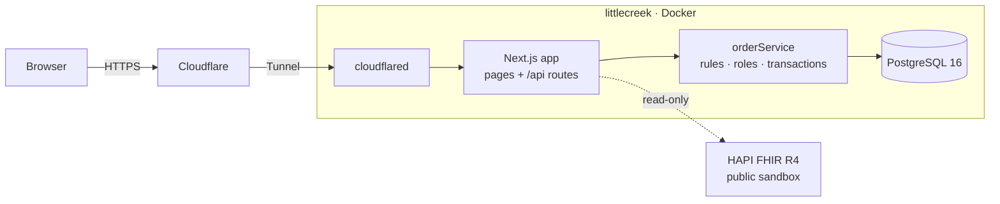

# Details

## Roles

Roles are cumulative (admin ⊃ pharmacist ⊃ technician). Checked server-side in `roleCan` (`src/lib/orderService.ts`).

| Action | Technician | Pharmacist | Admin |
| --- | :-: | :-: | :-: |
| Create order, fill verified order | yes | yes | yes |
| Verify, cancel, complete order | no | yes | yes |
| View audit log | no (dashboard shows only their own activity) | yes | yes |
| Adjust inventory stock | no | no | yes |

## Data model

- `medications` holds products, not drugs: one row per strength + dosage form (+ NDC). A drug's products share `name`; `brand_name`, `drug_class`, `route`, `rx_status` (`rx`/`otc`), `dea_schedule` (`II`–`V` or null) and `stock_unit` describe each one.
- `patients` (MRN, name, date of birth, allergies, phone) and `prescribers` (name, credentials, NPI, specialty, practice) are their own tables.
- `medication_orders` references a patient (required), a prescriber (required for Rx products, optional for OTC) and a product, and records directions (sig), quantity, refills and days supply.
- Migration `0001` turned the earlier free-text `patient_name` into patient rows (MRNs prefixed `MRN-L`) and linked existing orders before `0002` dropped the column.

## Prescription rules

Checked in `createOrder` (`src/lib/orderService.ts`); failures are `INVALID_INPUT` with the offending field, which the API returns as `fieldErrors` for the form.

| Rule | Field |
| --- | --- |
| Rx-only product needs a prescriber | `prescriberId` |
| Schedule II: no refills | `refills` |
| Schedule III–V: at most 5 refills | `refills` |
| Any product: at most 11 refills | `refills` |
| Days supply 1–365 when given | `daysSupply` |

## Order states

`pending → verified → filled → completed`, plus `pending/verified → cancelled`. Anything else returns `INVALID_TRANSITION`.

## Design notes

- All writes go through REST route handlers (`src/app/api/`) → `orderService`. No server actions.
- `OrderServiceError` codes (`FORBIDDEN`, `INVALID_TRANSITION`, `INSUFFICIENT_STOCK`, `STALE_STOCK`, `NOT_FOUND`, `INVALID_INPUT`) map to HTTP 403/409/404/400.
- Fill locks the order and medication rows (`FOR UPDATE`) so concurrent fills can't oversell stock.
- Auth: `POST /api/auth/login` checks the bcrypt hash and mints the `authjs.session-token` JWT cookie with Auth.js's `encode` (`src/lib/session.ts`). Auth.js itself is only used to *read* that cookie (`auth()` in pages and the proxy), so no Auth.js provider or `[...nextauth]` route exists. Keeping login a plain JSON route lets the API tests drive it directly. `src/proxy.ts` redirects unauthenticated page requests to `/login`, every page re-checks via `requirePageSession()`, and API routes return their own 401/403.
- Login is rate limited in three windows: 5 attempts per account+address and 100 per address per 5 minutes, plus 20 per account per 15 minutes across all addresses (credential stuffing). Each limiter tracks at most 10,000 keys. Failed attempts on existing accounts write `user.login_failed` audit rows in the background so they don't change response timing. They stay visible in the audit log by default; only successful sign-ins are hidden.
- Client addresses come from `CF-Connecting-IP`. Production is reachable only through the Cloudflare Tunnel, and Cloudflare overwrites that header, so clients can't forge it. `X-Forwarded-For`/`X-Real-IP` pass through Cloudflare unchanged and are used only as local/test fallbacks.
- `adjust-stock` requires `expectedQuantity` (the level the admin saw); a mismatch returns `STALE_STOCK` (409) rather than overwriting a concurrent change.
- Search boxes escape `%`, `_` and `\` so they match literally.
- "Completed today" and all displayed times use `CLINIC_TIME_ZONE`; the day boundary is computed in Postgres.
- `GET /api/health` runs `select 1` and backs the container healthcheck.
- `audit_logs.details` is jsonb (`from`, `to`, `quantity`, `stockBefore`, `stockAfter`, …).
- `/fhir` fetches `Patient` and `MedicationRequest` from https://hapi.fhir.org/baseR4 on the server only, cached 5 min, 8 s timeout; failures render a retry card.

## Tests

CI (GitHub Actions) runs lint, typecheck, the tests and a production build, then builds the Docker image and boots it against Postgres until `/api/health` answers.

`npm test` migrates the test DB (`db-test`, port 5434) then runs Vitest against real Postgres. Suites: `tests/orderService.test.ts` (state machine, roles, prescription rules, transactions, concurrency), `tests/api.test.ts` (route handlers, login hardening, health), `tests/security.test.ts` (redirect sanitising, rate limiter), `tests/fhir.test.ts` (offline mapper tests).

The concurrency tests fire simultaneous fills (8 orders competing for stock that covers one; the same order filled twice) and verify-vs-cancel on one order. They pre-open pooled connections so the transactions genuinely overlap. With the `FOR UPDATE` locks removed they fail, which is the point.

## Limitations

Demo only: not HIPAA-compliant, no password reset/MFA, no clinical logic. Replace `AUTH_SECRET` and credentials auth before any real use.

## Architecture



Every write goes through a REST route handler and then `src/lib/orderService.ts`. There are no server actions, so the API tests exercise the same code path as the UI.

| Layer | Choice |
| --- | --- |
| App | Next.js 16 (App Router, standalone output), React 19, TypeScript |
| UI | Tailwind CSS v4, IBM Plex Sans/Mono, Lucide icons |
| Data | PostgreSQL 16, Drizzle ORM and migrations, zod at the API boundary |
| Auth | Auth.js v5 to read sessions; a JSON login route mints the JWT cookie |
| Tests | Vitest against a real Postgres |
| Ops | Docker Compose, Cloudflare Tunnel, GitHub Actions |

```
src/app/            pages and /api route handlers
src/lib/            orderService (rules, transactions), queries, permissions, session, rate limiting
src/db/schema.ts    tables, enums and relations
drizzle/            SQL migrations
scripts/            migrate, seed and container start script
tests/              Vitest suites
```

## Environment variables

| Variable | Where | Purpose |
| --- | --- | --- |
| `DATABASE_URL`, `AUTH_SECRET`, `AUTH_TRUST_HOST=true` | `.env` | App |
| `CLINIC_TIME_ZONE` | `.env` (optional) | IANA zone for "today" and displayed times. Default `America/New_York` |
| `POSTGRES_USER`, `POSTGRES_PASSWORD`, `AUTH_SECRET`, `POSTGRES_DB` | `.env.prod` | Production; `POSTGRES_DB` is optional and defaults to `medops` |

## Deploy

```bash
docker compose --env-file .env.prod -f docker-compose.prod.yml up -d --build
```

- **Containers.** Postgres and the app. The app migrates and seeds at boot, runs as the unprivileged `node` user, and has a `/api/health` healthcheck.
- **Memory.** Capped at 384 MB for the app and 256 MB for Postgres.
- **Networking.** Nothing listens on a public port. The app joins the shared `edge` Docker network as `medops`, and a Cloudflare Tunnel carries traffic to it. TLS terminates at Cloudflare.
- **One-time setup.**
  - Run `docker network create edge` if it doesn't exist yet.
  - Add the public hostname `medops.leixue.dev → http://medops:3000` to the tunnel.
- **Secrets.** Generate them with `openssl rand -hex 32`. Hex output keeps the Postgres password URL-safe, which matters because compose builds `DATABASE_URL` from it.

## Security notes

**In place:**
- **Passwords.** bcrypt, with an equal-cost check for unknown emails and a single generic error message.
- **Login.** 429 responses with `Retry-After`. Failed attempts are audited with IP and user agent, never the password.
- **Client IP.** Read from `CF-Connecting-IP`, which Cloudflare overwrites. All traffic arrives through the tunnel.
- **Sessions.** HttpOnly, SameSite=Lax cookies, with the `__Secure-` prefix behind HTTPS.
- **Authorization.** Every API route checks session and role on the server, and every page redirects on its own as well as via the proxy.
- **Input.** zod at the boundary, a 16 KB cap on request bodies, parameterised queries, and search that escapes LIKE wildcards.

**Known trade-offs, deliberate for a demo:**
- **Session revocation.** Sessions are stateless JWTs valid for 7 days, so a role change takes effect when the token expires. A real deployment would shorten the lifetime and re-check the role, or keep a revocation list.
- **Rate limiter.** It lives in memory, per instance. Multiple replicas would need Redis or similar.
- **Trusted header.** `CF-Connecting-IP` is trusted because the origin has no public port. Only trusted services should share the `edge` network.
- **Audit immutability.** `audit_logs` is append-only by convention; the database role isn't yet barred from `UPDATE`/`DELETE`.
- **Demo accounts.** They're public, and there's no password reset or MFA.

## Screenshots

Taken from the live demo.

| | |
| --- | --- |
|  |  |
|  |  |
|  |  |
|  |  |
|  |  |
|  |  |
